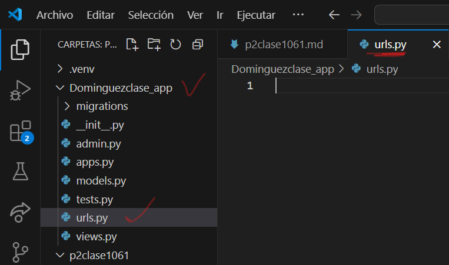
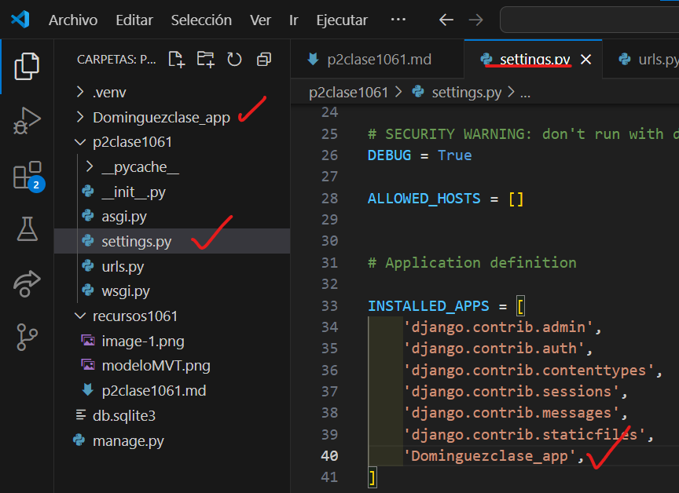
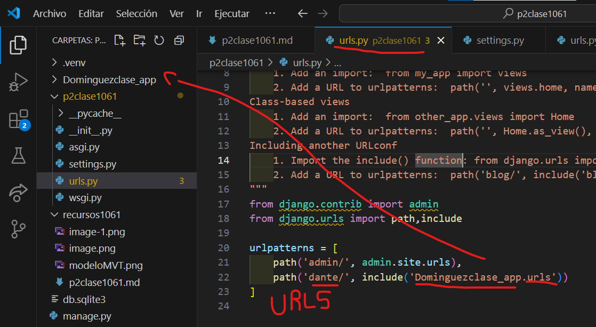
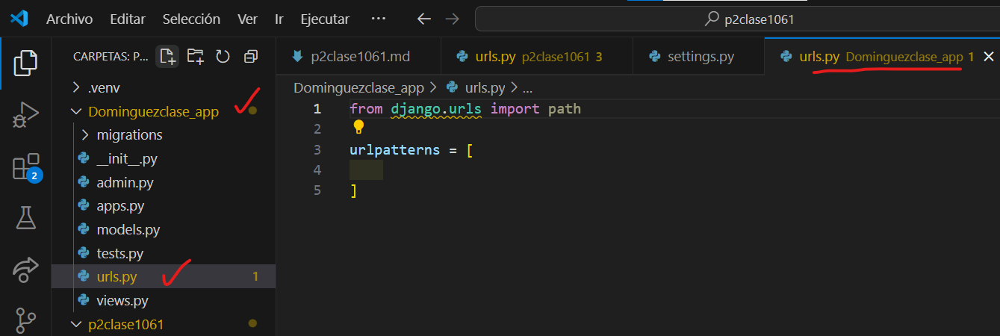
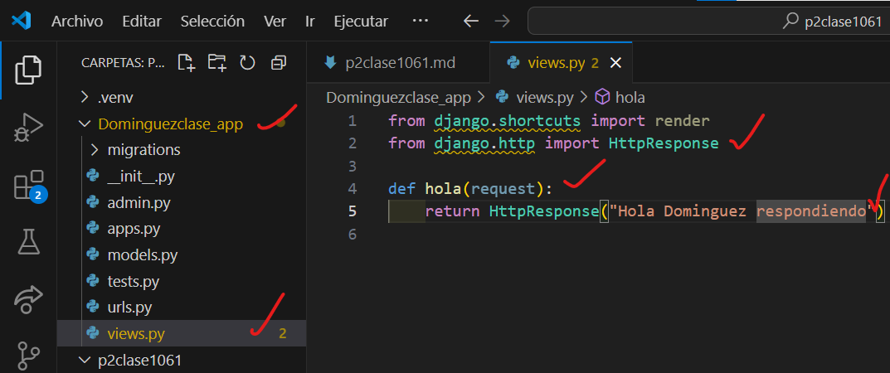
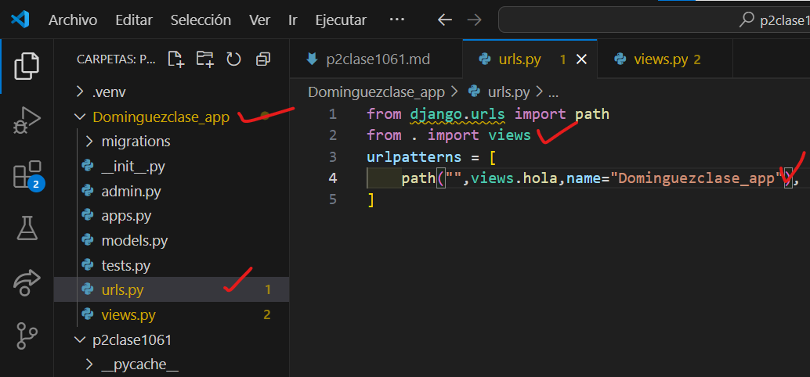

- Crear aplicacion Dominguezclase_app 
- Comando --> python manage.py startapp Dominguezclase_app
- Creamos el archivo urls.py en Dominguezclase_app
- 
- En setting.py de p2clase1061
- 
- En urls.py de p2clase1061
- 
- En urls.py en Dominguezclase_app
- 
- En views.py en Dominguezclase_app
- 
- En urls.py en Dominguezclase_app
- 